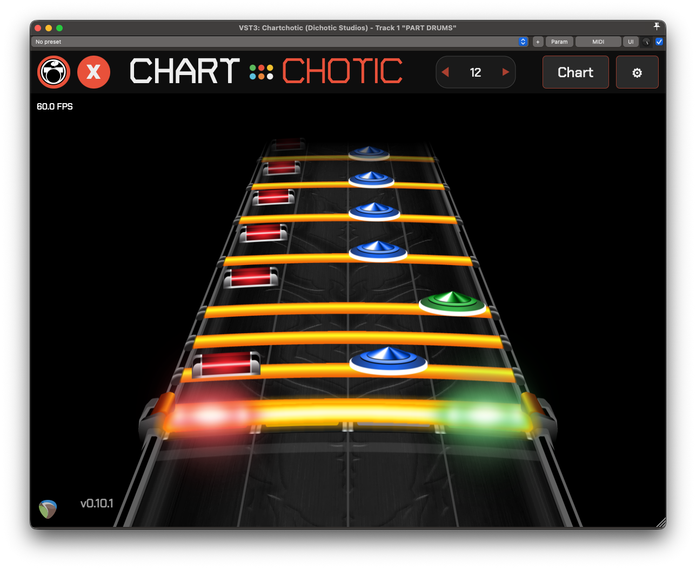

  

Chartchotic is a VST3/AU plugin that visualizes MIDI as rhythm game highways -- Clone Hero, YARG, and Rock Band style. Preview your charts in real time as you write them.

---

## Features

**Multi-Highway** - View up to 4 instruments or difficulties at once. Guitar, Bass, Keys, Drums, Rhythm, and Co-op Guitar are all supported.

**Guitar** - Notes, chords, sustains, HOPOs, opens, taps. Trill and tremolo lane markers. Configurable auto-HOPO threshold.

**Drums** - Standard and Pro Drums with cymbals, 2x kick, ghost/accent dynamics, and disco flip. Roll and swell lane markers.

**REAPER Integration** - Auto-discovers instrument tracks by name. Zero-latency timeline scrubbing. Live updates when tracks are added, removed, or renamed.

---

## DAW Compatibility

| DAW | Status | Notes |
|-----|--------|-------|
| **REAPER** | Fully supported | Zero-latency timeline scrubbing, auto track discovery, multi-highway |
| **Other DAWs** | Not currently supported | Broader DAW support planned for a future release |

---

## Installation

Download the latest version from [releases](https://github.com/noahbaxter/chartchotic/releases).

**macOS:**
- VST3: `~/Library/Audio/Plug-Ins/VST3/`
- AU: `~/Library/Audio/Plug-Ins/Components/`

**Windows:**
- Most DAWs: `C:\Program Files\Common Files\VST3\`
- REAPER: Check Preferences > Plug-ins > VST for custom paths

**Linux:**
- User: `~/.vst3/`
- System: `/usr/local/lib/vst3/` or `/usr/lib/vst3/`

After installing, restart your DAW to autoscan for the plugin.

---

## Quick Start

1. Add Chartchotic to any MIDI track in REAPER
2. Name your tracks using standard chart names: `PART GUITAR`, `PART BASS`, `PART DRUMS`, `PART KEYS`
3. The plugin auto-discovers instruments and displays them
4. Click instrument/difficulty icons in the toolbar to control what's visible
5. Adjust note speed and highway length to your liking

---

## Supported Track Names

| Track Name | Instrument |
|------------|-----------|
| `PART GUITAR` | Lead Guitar |
| `PART GUITAR COOP` | Co-op Guitar |
| `PART RHYTHM` | Rhythm Guitar |
| `PART BASS` | Bass |
| `PART KEYS` | Keys |
| `PART DRUMS` | Drums |

---

## Support

Have questions or found a bug? [Open an issue](https://github.com/noahbaxter/chartchotic/issues).

Want to support development? [Donate here](https://www.paypal.com/donate/?business=3P35P46JLEDJA&no_recurring=0&item_name=Support+the+ongoing+development+of+Chart+Preview.&currency_code=USD).

---

## License

Chartchotic is open source under the MIT license. Art assets are provided for build purposes only.

**Art credits:**
- [Inventor211](https://www.youtube.com/@inventor211) - Chart assets
- [kanaizo](https://youtube.com/@kanaizo) - Bundled highway textures
